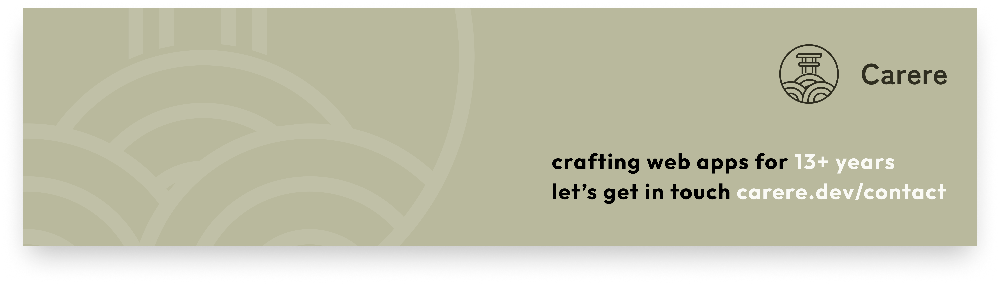

  

# Hi, I'm Kevin Abatan 👋

Developer focused on reliable products and clean user experiences.
I keep things simple, ship useful features, and improve a little every day.

## What I'm focused on

- **[Zaidan](https://github.com/carere/zaidan)** — Use ShadCN React components in SolidJS projects
- **Delimoov** — Carrier management software for the automotive industry
- Writing articles about what I discover along the way

  
  
  
  
  
  
  
  
  
  

---

  <a href="https://www.linkedin.com/in/kevin-abatan-94538085/">LinkedIn</a> &nbsp;·&nbsp;
  <a href="https://x.com/carere_dev">X (@carere_dev)</a> &nbsp;·&nbsp;
  <a href="https://carere.dev">carere.dev</a>

